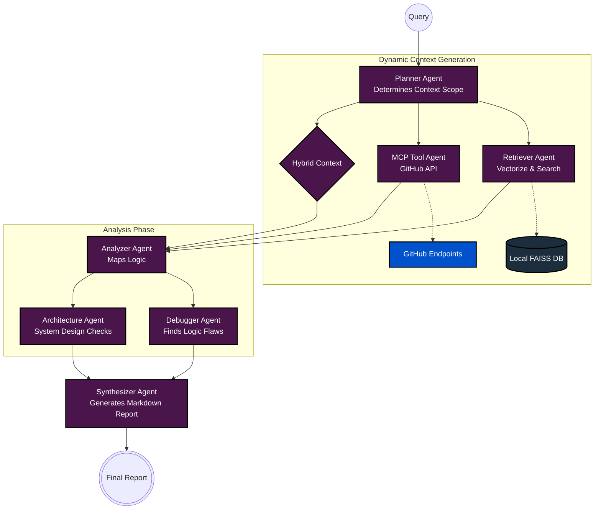
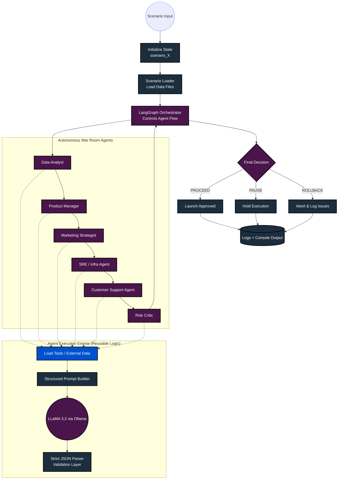

# AI-Powered GitHub Code Intelligence & Review System

An enterprise-grade, Multi-Agent AI architecture combining **Retrieval-Augmented Generation (RAG)** and the **Model Context Protocol (MCP)** to intelligently review codebases, spot logical bugs, explain architectures, and query live GitHub data dynamically.

---

## 🏗️ System Architecture

This project is built around **LangGraph** to predictably orchestrate seven specialized AI Agents. Depending on the query space (Local vs Remote GitHub), the system dynamically routes tool usage to minimize hallucination and maximize precision.



## 🔄 Semantic Workflow Details

Instead of blindly feeding massive text files to an LLM, the local codebase is structurally decomposed using `tree-sitter`. The diagram below illustrates how code is processed before and after prompting.



---

## 🚀 Features That Stand Out

1. **AST-Driven Vector Chunking**: Instead of relying on naive line-based text splitters, we use Tree-Sitter to extract *perfectly bounded* functions and classes. This ensures the LLM never receives half-cut context windows.
2. **Model Context Protocol (MCP)**: Implements the exact same zero-shot framework that powers VS Code's Copilot and Anthropic's Claude to trigger dynamic real-time integrations to GitHub repos natively via standard JSON RPC.
3. **No-Latency DAG Execution (LangGraph)**: The multi-agent formulation guarantees strict outputs separated by concern avoiding single-prompt confusion that plagues simplistic systems.
4. **Dynamic Ephemeral Memory**: FAISS vector indices are generated entirely on-the-fly and cleaned to ensure guaranteed codebase sync and to prevent token bloat across versions.

## 💻 Tech Stack
- **Orchestration**: `langgraph`, `langchain-core`
- **Models**: `langchain-google-genai` (Gemini Flash + Gemini Embeddings)
- **Vector Core**: `faiss-cpu`
- **AST Engine**: `tree-sitter`, `tree-sitter-python`
- **Client Protocol**: `@modelcontextprotocol/server-github` via NodeJS STDIO invocation.

## 🛠️ Quickstart

1. Clone repo, install dependencies from `requirements.txt`.
2. Copy .env.example to .env and configure `.env`:
   ```env
   GOOGLE_API_KEY=your_gemini_key
   GITHUB_PERSONAL_ACCESS_TOKEN=your_token
   ```
3. Run Local RAG Retrieval:
   ```bash
   python main.py "Find potential bugs in the AST parser"
   ```
4. Run Remote GitHub Investigation:
   ```bash
   python main.py "Fetch and summarize the active issues for repo github_username/repository_name"
   ```

### For example queries , look into terminal_exeecution_logs.md

### 📧 For any queries, contact me at [anughnakandimalla11@gmail.com](anughnakandimalla11@gmail.com).

## 👩‍💻Author

Anughna
